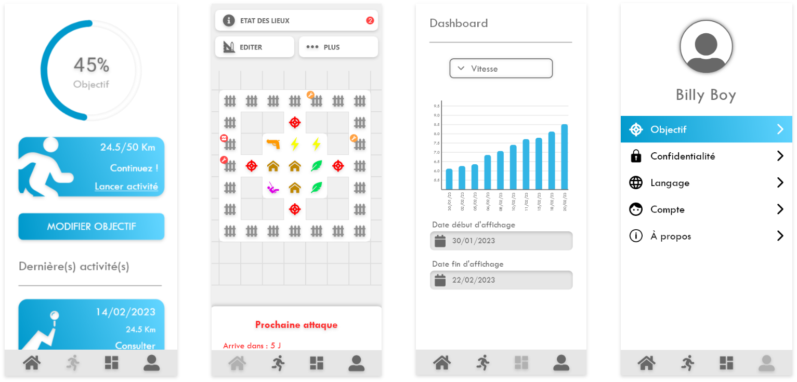
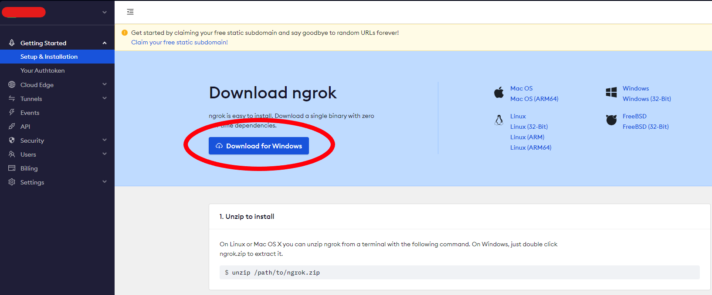
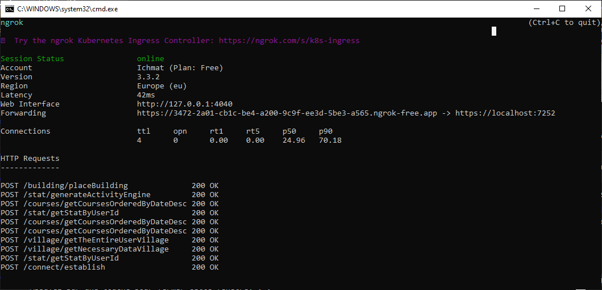
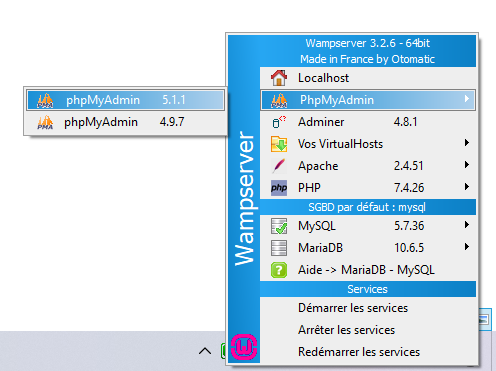
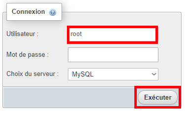
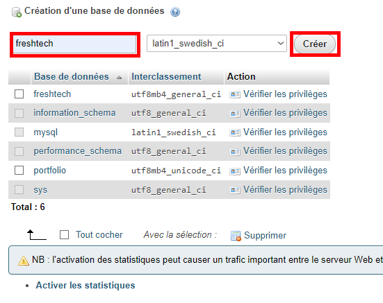
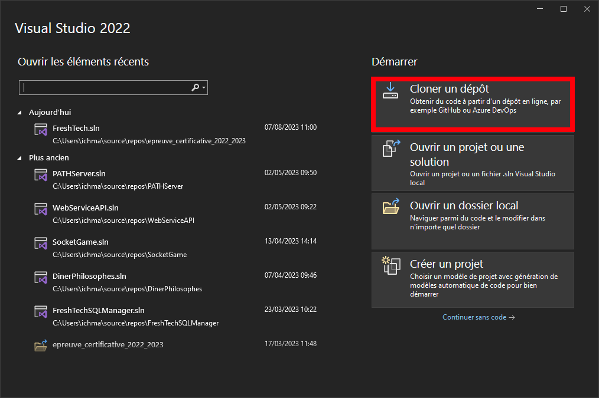
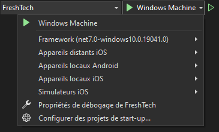
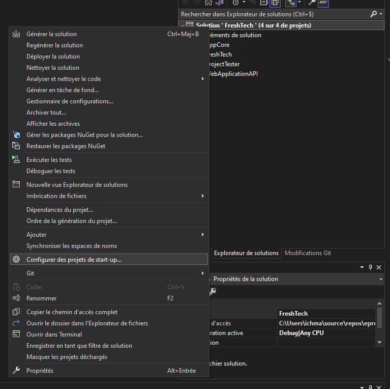
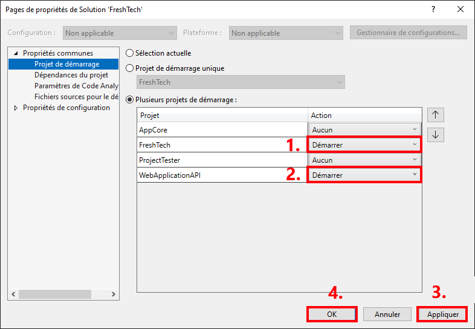

# Application running : FreshTech

Notre application a pour objectif de motiver ses utilisateurs à poursuivre un rythme d’exercice régulier en améliorant leurs motivations. 
Pour cela nous souhaitons proposer une expérience de jeux immersive lors de la pratique du sport, proposer des défis de courses unique pour 
l’insister à se surpasser, offrir des mécanismes de progression pour encourager les joueurs et maintenir l’intérêt pour l’application.



# Démo 


# Sommaire

<!--TOC-->
- [Prérequis](#prerequis)
- [I Préparation](#i-preparation)
  - [I.1 Ngrok](#i.1-ngrok)
  - [I.2 WAMP](#i.2-wamp)
- [II Lancement](#ii-lancement)
<!--/TOC-->

# Prérequis 

Outils nécessaires :
- [Visual Studio 2022](https://visualstudio.microsoft.com/fr/vs/)
- [Ngrok](https://ngrok.com)
- [WAMP](https://www.wampserver.com)
- [Android Studio](https://developer.android.com/studio) (optionnel, si vous avez un téléphone android)

Framework :
- .NET 7

# I Préparation 

Une fois les outils installés, il faudra passer par quelques étapes de configurations.

## I.1 Ngrok

1. Il faudra [s'incrire](https://dashboard.ngrok.com/signup)
à Ngrok pour effectuer les redirection de requête pour l'API. (Si vous avez déjà un compte
[connectez-vous ici](https://dashboard.ngrok.com/login))

2. Sur le menu Ngrok, allez sur [Setup & Installation](https://dashboard.ngrok.com/get-started/setup),
puis télécharger ngrok puis le dézipper.



3. Ouvrir le cmd, et se placer au même endroit où Ngrok est installée puis executé cette commande suivante.
Votre clé d'API ce trouve [ici](https://dashboard.ngrok.com/get-started/your-authtoken)

```shell
ngrok config add-authtoken <apiKey>
```

4. (optionnel) Afin de faciliter les futures préparatif, nous allons créer un fichier `.bat` afin de lancer rapidement Ngrok. 
Commencer par créer ce fichier `startngrok.bat`. Puis éditez ce fichier.

> Le fichier `startngrok.bat` doit se trouver dans le même fichier que Ngrok pour fonctionner

5. (optionnel) Ajouter `ngrok http https://localhost:7252`.

Maintennant, Ngrok est prêt à l'emploi. Si vous lancer le fichier `startngrok.bat` ou lancer ngrok puis écrire la
commande suivante `http https://localhost:7252`, celui-ci devrait se lancer.



## I.2 WAMP

1. Lancer WAMP et attendre que tout les services soient lancés : 

2. Ouvrir **phpMyAdmin** :

	- Clique gauche sur le logo  >PhpMyAdmin>5.1.1 

	

	- Ou aller sur le lien suivant : http://localhost/phpmyadmin/

3. Par défaut, le compte racine ne possède pas de mot de passe, pour se connecter, il faut simplement entrer
`root` dans le champs **utilisateur** et **Executer**.

	

4. Créer une base de donnée nommé **freshtech**

    

> ⚠ il est important de respecter le nom de la BDD

# II Lancement 

1. Lancer visual studio, puis **Cloner un dépôt**



2. Renseigner le lien suivant : https://github.com/ichmat/epreuve_certificative_2022_2023 <br>
Puis effectuer le clonnage. Attendre que le projet ce configure.

3. Cliquer maintenant sur le petit chevron à côté de **Windows machine**.

    

	Plusieurs options selon votre cas : 

	- Vous avez un téléphone android en mode débug, cliquer sur **Appareils locaux android**

	- Vous avez installer Android Studio, cliquer sur **Créer un émulateur**

4. Configurer plusieurs projets de démmarrage, clique droit sur `Solution 'FreshTech'` puis `⚙ Configurer des projets de start-up`

    

5. Cliquer sur **Plusieurs projets de démarrage** et selectionner en mode **Démarrer** :

	- WebApplicationAPI
	- FreshTech

	

